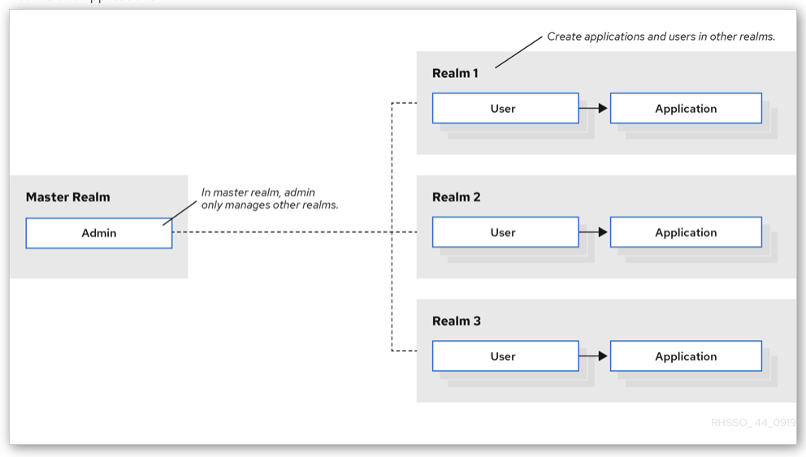

# Goal

```
┌────────────────────┐
│                    │
│      keycloak      │
│   OpenID Connect   │
│                    │
└────────────────────┘
           ▲
           │
           │ authenticate
           │
           ▼
┌────────────────────┐              ┌────────────────────┐
│                    │              │                    │
│    Application     │    access    │      Resource      │
│       NextJs       │─────────────▶│        API         │
│                    │              │                    │
└────────────────────┘              └────────────────────┘
```

## Keycloak

### Realm

สร้าง Realm



### Frontend client

สร้าง Client สำหรับ Application


copy client secret


## NextJs

### Library

Install [next-auth](https://next-auth.js.org)

```sh
npm install next-auth
```

### Local Config file

สร้าง .env.local

```
KEYCLOAK_CLIENT_ID=day6_app
KEYCLOAK_CLIENT_SECRET=Nuj75G9SqfHlrXay0QYBGUrwJnuFyAUK
KEYCLOAK_ISSUER=http://localhost:8080/realms/Day6
```

### API route

สร้าง file `pages/api/auth/[...nextauth].js`

```js
import NextAuth from "next-auth/next";
import KeycloakProvider from "next-auth/providers/keycloak";

export const authOptions = {
  providers: [
    KeycloakProvider({
      clientId: process.env.KEYCLOAK_CLIENT_ID,
      clientSecret: process.env.KEYCLOAK_CLIENT_SECRET,
      issuer: process.env.KEYCLOAK_ISSUER,
    }),
  ],
};

export default NextAuth(authOptions);
```

แก้ไข file pages/\_app.jsx เพิ่ม SessionProvider ที่จะทำการ provide session ให้กับทุกๆ component

```jsx
import { SessionProvider } from "next-auth/react";
import "../styles/globals.css";

function MyApp({ Component, pageProps: { session, ...pageProps } }) {
  return (
    <SessionProvider session={session}>
      <Component {...pageProps} />
    </SessionProvider>
  );
}

export default MyApp;
```

สร้าง components/login-btn.jsx

```jsx
import { useSession, signIn, signOut } from "next-auth/react";

export default function Component() {
  const { data: session } = useSession();
  if (session) {
    return (
      <>
        <p className="mb-4">Signed in as {session.user.email} </p>
        <button
          className="bg-red-400 text-white rounded px-4 py-2"
          onClick={() => signOut()}
        >
          Sign out
        </button>
      </>
    );
  }
  return (
    <>
      <p className="mb-4">Not signed in </p>
      <button
        className="bg-blue-400 text-white rounded px-4 py-2"
        onClick={() => signIn()}
      >
        Sign in
      </button>
    </>
  );
}
```

แก้ไข file pages/index.js

```jsx
import LoginButton from "../components/login-btn";

export default function Home() {
  return (
    <div className="m-8 p-8">
      <div>
        <LoginButton />
      </div>
    </div>
  );
}
```

ทดสอบ `npm run dev`
แล้วกด Sign In
จะได้ error


ถ้า copy url มาดู จะมีหน้าตาดังนี้

```
http://localhost:8080/realms/day6/protocol/openid-connect/auth?client_id=day6_app&scope=openid%20email%20profile&response_type=code&redirect_uri=http%3A%2F%2Flocalhost%3A3000%2Fapi%2Fauth%2Fcallback%2Fkeycloak&state=cPbHKZBEJXZEtNlWNhJdTOi9w8K4qQrXrvqzE_a_Nuw&code_challenge=FUXm_qnYwqgIRS6VHvm-VFAzpdLvWiniiMNZGVBg7xI&code_challenge_method=S256
```

ถ้า parse query parameters จะพบตัวแปรเหล่านี้ (อ่านคำอธิบายที่นี่ [Link](https://openid.net/specs/openid-connect-core-1_0-17.html#AuthRequest))

```
'client_id':	    day6_app
'scope':	        openid email profile
'response_type':	code
'redirect_uri':	    http://localhost:3000/api/auth/callback/keycloak
'state':	        cPbHKZBEJXZEtNlWNhJdTOi9w8K4qQrXrvqzE_a_Nuw
'code_challenge':	FUXm_qnYwqgIRS6VHvm-VFAzpdLvWiniiMNZGVBg7xI
'code_challenge_method':	S256
```

เข้าไปที่ configuration ของ keycloak ทำการตั้งค่า callback url ในหน้า client detail


ถ้าทดลองกด Sign in with keycloak ใหม่ ก็จะถูก redirect ไปที่หน้า Sign In ของ keycloak


กลับไปสร้าง user และ credential ใน keycloak ก่อนที่จะทดสอบ sign in, หลังจาก sign in สำเร็จก็จะขึ้นหน้าจอนี้


ทดลองแก้ไข /components/login-btn.jsx ให้ render ตัวแปร session ออกมาดู

```jsx
<pre>{JSON.stringify(session, null, 2)}</pre>
```


สรุป flow ที่เกิดขึ้น


แล้ว Access Token จะเข้าถึงได้อย่างไร เพราะเราจะนำไปใช้ในการเรียก api ที่ต้องการ

```
┌────────────────────┐
│                    │
│      keycloak      │
│   OpenID Connect   │
│                    │
└────────────────────┘
           ▲
           │
           │ authenticate
           │
           ▼
┌────────────────────┐              ┌────────────────────┐
│                    │              │                    │
│    Application     │    access    │      Resource      │
│       NextJs       │─────────────▶│        API         │
│                    │ [accesstoken]│                    │
└────────────────────┘              └────────────────────┘
```

แก้ไข [...nextauth].js เพิ่ม callback เพื่อดึง data ออกมาใส่ nextjs token
[https://next-auth.js.org/configuration/callbacks#jwt-callback]

```js
import NextAuth from "next-auth/next";
import KeycloakProvider from "next-auth/providers/keycloak";

export const authOptions = {
  providers: [
    KeycloakProvider({
      clientId: process.env.KEYCLOAK_CLIENT_ID,
      clientSecret: process.env.KEYCLOAK_CLIENT_SECRET,
      issuer: process.env.KEYCLOAK_ISSUER,
    }),
  ],
  callbacks: {
    async jwt({ token, account, profile }) {
      if (account?.access_token) {
        token.accessToken = account.access_token;
        token.refreshToken = account.refresh_token;
        token.accessTokenExpired = account.expires_at * 1000;
      }
      return token;
    },
  },
};

export default NextAuth(authOptions);
```

เพิ่ม Session callback

```js
async session({ session, token }) {
  session.accessToken = token.accessToken;
  session.accessExpired = token.accessTokenExpired;
  return session;
},
```

แล้วถ้า accessToken หมดอายุหล่ะ
แยกประเด็นนี้ออกเป็น 2 issues

- จะรู้ตอนไหนว่าหมดอายุ
- จะขอ access_token ใหม่อย่างไร

### ประเด็นตรวจสอบการหมดอายุ

callback jwt จะถูกเรียกทุกครั้งที่มีการ useSession
ดังนั้นเราสามารถดักตรวจสอบที่จุดนี้ได้

```js
if (Date.now() < token.accessTokenExpired) {
  return token;
} else {
  return refreshAccessToken(token);
}
```

การขอ refresh token
[https://stackoverflow.com/questions/51386337/refresh-access-token-via-refresh-token-in-keycloak]

```js
const refreshAccessToken = async (token) => {
  try {
    const details = {
      client_id: process.env.KEYCLOAK_CLIENT_ID,
      client_secret: process.env.KEYCLOAK_CLIENT_SECRET,
      grant_type: ["refresh_token"],
      refresh_token: token.refreshToken,
    };
    const formBody = [];
    Object.entries(details).forEach(([key, value]) => {
      const encodedKey = encodeURIComponent(key);
      const encodedValue = encodeURIComponent(value);
      formBody.push(encodedKey + "=" + encodedValue);
    });
    const formData = formBody.join("&");
    const url = process.env.KEYCLOAK_REFRESK_TOKEN_URL;
    const response = await fetch(url, {
      method: "POST",
      headers: {
        "Content-Type": "application/x-www-form-urlencoded;charset=UTF-8",
      },
      body: formData,
    });
    const refreshedTokens = await response.json();
    if (!response.ok) throw refreshedTokens;
    return {
      ...token,
      accessToken: refreshedTokens.access_token,
      accessTokenExpired: Date.now() + (refreshedTokens.expires_in - 15) * 1000,
      refreshToken: refreshedTokens.refresh_token ?? token.refreshToken,
      refreshTokenExpired:
        Date.now() + (refreshedTokens.refresh_expires_in - 15) * 1000,
    };
  } catch (error) {
    return {
      ...token,
      error: "RefreshAccessTokenError",
    };
  }
};
```

## Backend API

- create laravel project
- use [https://github.com/robsontenorio/laravel-keycloak-guard]

configuration

```php

return [
    'realm_public_key' => env('KEYCLOAK_REALM_PUBLIC_KEY', null),

    'load_user_from_database' => env('KEYCLOAK_LOAD_USER_FROM_DATABASE', true),

    'user_provider_custom_retrieve_method' => null,

    'user_provider_credential' => env('KEYCLOAK_USER_PROVIDER_CREDENTIAL', 'username'),

    'token_principal_attribute' => env('KEYCLOAK_TOKEN_PRINCIPAL_ATTRIBUTE', 'preferred_username'),

    'append_decoded_token' => env('KEYCLOAK_APPEND_DECODED_TOKEN', false),

    'allowed_resources' => env('KEYCLOAK_ALLOWED_RESOURCES', null),

    'ignore_resources_validation' => env('KEYCLOAK_IGNORE_RESOURCES_VALIDATION', false),

    'leeway' => env('KEYCLOAK_LEEWAY', 0),

    'input_key' => env('KEYCLOAK_TOKEN_INPUT_KEY', null)
];

```

.env

```
KEYCLOAK_REALM_PUBLIC_KEY="MIIBIjA....QPAgw8HU0UW7y/pZB7mUDoKwSKq+QIDAQAB"
KEYCLOAK_ALLOWED_RESOURCES=test
KEYCLOAK_LOAD_USER_FROM_DATABASE=false
KEYCLOAK_IGNORE_RESOURCES_VALIDATION=true
```

public key donwload จาก `realm settings -> Keys -> RS256`

config/auth.php

```
        'api' => [
            'driver' => 'keycloak',
            'provider' => 'users',
        ],
```

สร้าง route ง่ายๆ /user

```php
Route::middleware('auth:api')->get('/user', function (Request $request) {
    return $request->user();
});
```

## call laravel /user จาก NextJS

แก้ไข pages/index.js

```jsx
const [user, setUser] = useState(null);

useEffect(() => {
  async function fetchUser() {
    try {
      const resp = await fetch("http://day6-api.test/api/user", {
        headers: {
          Authorization: `Bearer ${session?.accessToken}`,
          Accept: "application/json",
          "Content-Type": "application/json",
        },
      });
      if (resp.status === 200) {
        setUser("call laravel /api/user successfully");
      } else {
        setUser("call laravel /api/user return ${resp.status}");
      }
    } catch (e) {
      setUser("laravel error " + e);
      console.error(e);
    }
  }
  if (session) {
    fetchUser();
  }
}, [session]);
```

แสดงผลลัพท์การเรียก /api/user

```jsx
<div>{user}</div>
```
